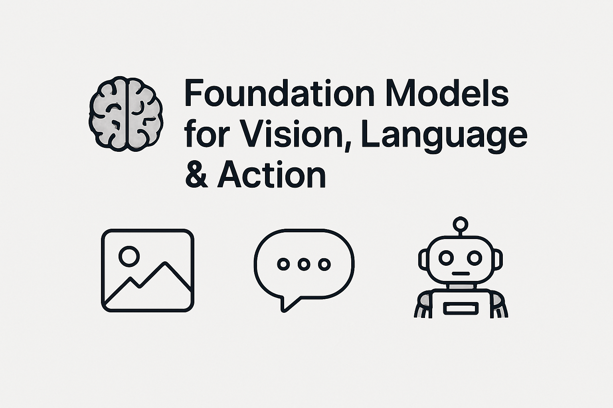

# 🧠 Foundation Models for Vision, Language & Action

  
   
  <em>Made by AI with 💻 compute</em>

---

## 1️⃣ Vision Models

### ✔️ Papers Done
- **CLIP** – [Contrastive Language–Image Pretraining (2021)](https://arxiv.org/abs/2103.00020)
- **ViT** – [An Image is Worth 16x16 Words (2020)](https://arxiv.org/abs/2010.11929)

---

## 2️⃣ Language Models

### ✔️ Papers Done
- **Mistral MoE** – [Mixtral of Experts (2023)](https://arxiv.org/abs/2401.04088)
- **GPT-2** – [Language Models are Unsupervised Multitask Learners (2019)](https://cdn.openai.com/better-language-models/language_models_are_unsupervised_multitask_learners.pdf)

---

## 3️⃣ Action Models 🤖

### ⏳ To Be Updated
- *(Work in progress)*
